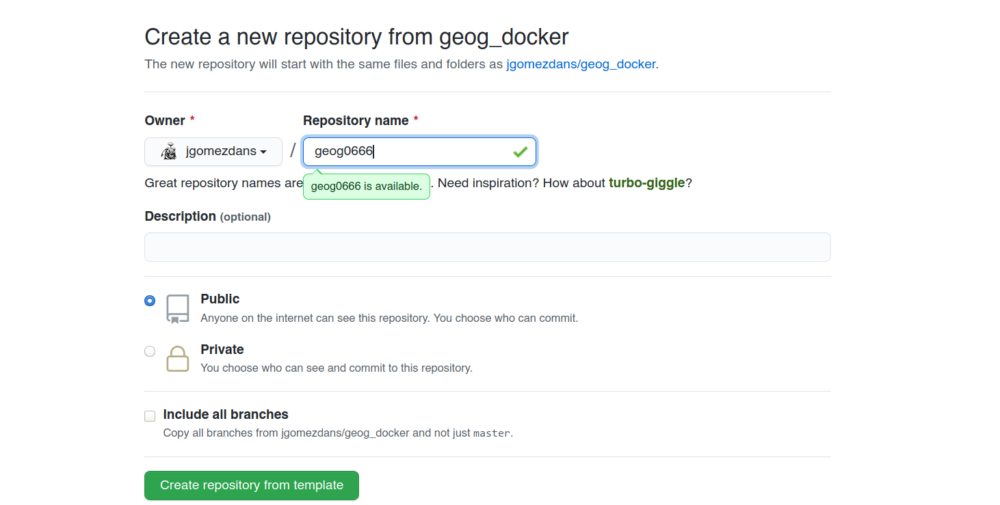
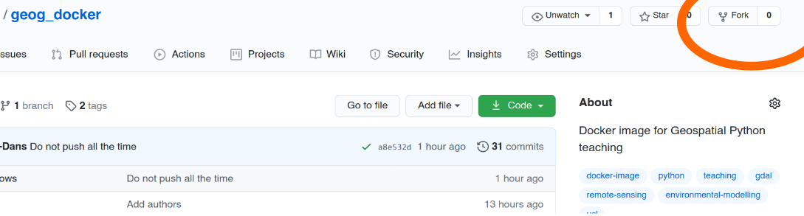
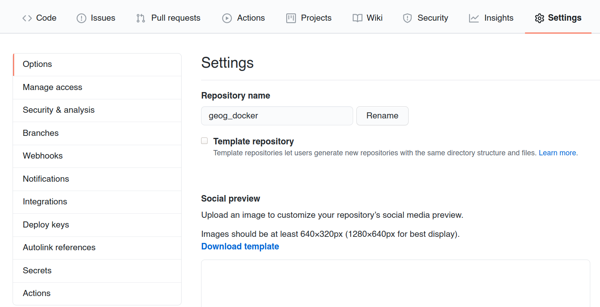
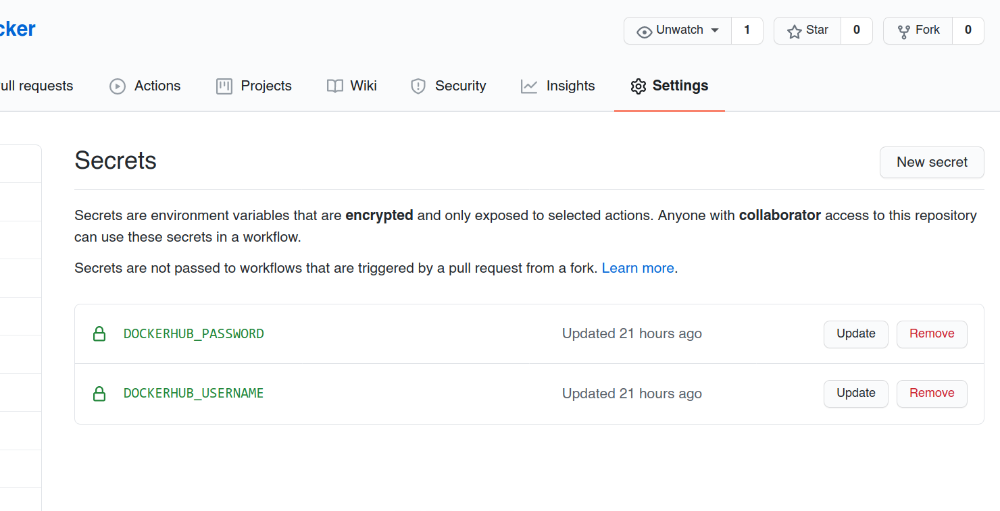

# Step by step instructions to use this repository

## Get a GitHub account

You probably have one, but if not... Go ahead and get one. 

## Create a copy of our *template* repository

Go to the [github page](https://github.com/jgomezdans/geog_docker) of this repository, and click on the **Use this template** button. This will basically create a new repository under your username, with all the files and stuff that we've put together. You just need to give it a sensible name. We'll use `geog0666` here, because invoking evil is always a good starting point.




## If you can't create from the template, fork the repository 

Forking is only really recommended if you want to quickly fixe something and feed it back to the main repository, but can also work as a way to publish your own course.

Go to the [github page](https://github.com/jgomezdans/geog_docker) of this repository, and click on the **Fork** icon.



## Setting up the credentials for Docker builds

### Get a Docker account

Go to [Docker Hub](https://hub.docker.com/) and get yourself an account.

You'll need the username and password to allow GitHub to upload (i.e. *push*) your images to docker hub.

### Linking Docker hub and github

We need to connect the hubs. On the forked repository, go to the **"Settings"** tab, and then on to the tab that reads **"Secrets"**




You need to create two variables `DOCKERHUB_USERNAME` and `DOCKERHUB_PASSWORD`, which will store your username and password in [hub.docker.com](https://hub.docker.com/). 



## Modifying the image itself

### Clone your forked repository

You can do this on the command line using

```
   git clone  git@github.com:jgomezdans/geog0666.git
```

(change that github address to that of your repository, usually `<username>/<repository_name>`). You can then edit the files locally.

### Changing packages

You can edit the `Docker/environment.yml` file to change the packages you want installed. For example, for your new course, we'll add some extra packages at the end, and change the environmnet name to the course environmnet name. 

```yaml
name: geog0666
channels:
  - conda-forge
  - defaults
dependencies:
  - python>=3.7
  - nomkl
  - libgdal
  - geopandas
  - rasterio
  - scipy
  - gdal
  - beautifulsoup4
  - fiona
  - numpy
  - statsmodels
  - cartopy
  - scikit-image
  - netcdf4
  - scikit-learn
  - matplotlib-base
  - pandas
  - shapely
  - ipyleaflet
  - pytest
  - seaborn
  - hdf5
  - flake8
  - ipywidgets
  - xarray
  - black
  - folium
  - jupyter_console
  - pandocfilters
  - nbconvert
  - jup7yterlab
  - pandoc
  - pyephem
  - libnetcdf
  - ipykernel
  - ipympl
  - pip
  - yapf
  - autopep8
  - osmnx
  - networkx
  - tensorflow 
  - nltk 
```

### Modify continuous integration names

You may also want to change the names of the Docker images to reflect your course name (e.g. `geog0666`). To do this, you need to change the image name in a couple of places:

- `.github/workflows/docker-run.yml` Change all the occurrences of `uclgeog` to your course name (e.g. `geog0666`).
- `.github/workflows/docker-image.yml` Change all the occurrences of `uclgeog` to your course name (e.g. `geog0666`).

`docker-image.yml`

```yaml
name: Publish release

on:
  release:
    types: [published]

jobs:

  build:

    runs-on: ubuntu-latest

    steps:
    - uses: actions/checkout@v2

    - uses: whoan/docker-build-with-cache-action@master
      with:
        username: "${{ secrets.DOCKERHUB_USERNAME }}"  
        password: "${{ secrets.DOCKERHUB_PASSWORD }}" 
        dockerfile: Docker/Dockerfile
        image_name: geog0666
        build_extra_args: "--target geog0666"
        push_git_tag: true
        push_image_and_stages: true
    - name: Run test
      run: |
        docker run --rm -d --name test_container -p 8888:8888 "${{ secrets.DOCKERHUB_USERNAME }}"/geog0666
        docker run --link test_container:test_container waisbrot/wait
        curl --fail http://localhost:8888

```

`docker-run.yml`

```yaml
name: Test docker image

on: [push]

jobs:

  build:

    runs-on: ubuntu-latest

    steps:
    - uses: actions/checkout@v2
    - uses: whoan/docker-build-with-cache-action@master
      with:
        username: "${{ secrets.DOCKERHUB_USERNAME }}"  
        password: "${{ secrets.DOCKERHUB_PASSWORD }}" 
        dockerfile: Docker/Dockerfile
        image_name: geog0666-test
        build_extra_args: "--target geog0666"
        push_git_tag: true
        push_image_and_stages: true
    - name: Run test
      run: |
        docker run --rm -d --name test_container -p 8888:8888 "${{ secrets.DOCKERHUB_USERNAME }}"/geog0666-test
        docker run --link test_container:test_container waisbrot/wait
        curl --fail http://localhost:8888
```

### Modify the Dockerfile

You should also change the Dockerfile to reflect the name of your new course. Literally, this are the two line surrounded by `***`

```docker
########################################################################
# The course-specific docker file
########################################################################

#***********************************************************************
FROM conda-base as geog0666
#***********************************************************************

LABEL maintainer="Jose Gomez-dans <j.gomez-dans@ucl.ac.uk"
ARG NB_USER="jovyan"
ARG NB_UID="1000"
ARG NB_GID="100"

# Fix DL4006
SHELL ["/bin/bash", "-o", "pipefail", "-c"]


# name your environment
#***********************************************************************
ARG conda_env=geog0666
#***********************************************************************
ENV PATH=$CONDA_DIR/bin:$PATH \
    HOME=$HOME

RUN rm -rf "${HOME}"/tmp/ && mkdir -p "${HOME}"/tmp/

# Switch back to jovyan to avoid accidental container runs as root
USER $NB_UID

WORKDIR "${HOME}"


COPY Docker/environment.yml "${HOME}"/tmp/
RUN cd "${HOME}"/tmp/ && \
     conda env create -p $CONDA_DIR/envs/$conda_env -f environment.yml && \
     conda clean --all -f -y \
    && rm -rf "${HOME}"/tmp/environment.yml \
    && find /opt/conda/ -follow -type f -name '*.a' -delete \
    && find /opt/conda/ -follow -type f -name '*.pyc' -delete \
    && find /opt/conda/ -follow -type f -name '*.js.map' -delete


# create Python 3.x environment and link it to jupyter
RUN $CONDA_DIR/envs/${conda_env}/bin/python -m ipykernel install --user --name=${conda_env} && \
    fix-permissions $CONDA_DIR && \
    fix-permissions "${HOME}"

ENV PATH=$CONDA_DIR/envs/${conda_env}/bin:$PATH

ENV CONDA_DEFAULT_ENV=${conda_env}


RUN python -m pip install jupyterthemes && \
    python -m pip install --upgrade jupyterthemes && \
    python -m pip install jupyter_contrib_nbextensions && \
    jupyter contrib nbextension install --user && \
    rm -rf ${HOME}/.cache/pip
# enable the Nbextensions
RUN jupyter nbextension enable contrib_nbextensions_help_item/main && \
    jupyter nbextension enable autosavetime/main && \
    jupyter nbextension enable codefolding/main && \
    jupyter nbextension enable code_font_size/code_font_size && \
    jupyter nbextension enable code_prettify/code_prettify && \
    jupyter nbextension enable collapsible_headings/main && \
    jupyter nbextension enable comment-uncomment/main && \
    jupyter nbextension enable equation-numbering/main && \
    jupyter nbextension enable execute_time/ExecuteTime && \
    jupyter nbextension enable gist_it/main && \
    jupyter nbextension enable hide_input/main && \
    jupyter nbextension enable spellchecker/main && \
    jupyter nbextension enable toc2/main && \
    jupyter nbextension enable toggle_all_line_numbers/main && \
    jupyter nbextension enable exercise2/main  && \
    rm -rf "${HOME}"/.cache/pip
    


RUN mkdir -p "${HOME}"/notebooks
RUN fix-permissions "${HOME}"/notebooks/
COPY notebooks/* "${HOME}"/notebooks/
RUN jupyter trust notebooks/*ipynb 


WORKDIR $HOME
```


Note that although I'm putting all these configuration files here, you mostly need to change the course name in all of them. Github templates do not allow for "template variables", which would simplify this, but this is not available on Github. Groan.

### Adding content

You can also add notebooks by dropping them in the `notebooks` folder. They will be copied to the Docker image. You may also want to add Python code files here, although it may be better to pack this as individual Python packages that can be pip-installed.

You can just copy the files to the folder, and then add them to the repository using e.g.

```
git add notebooks/*.ipynb
```

### Test locally

You can use the local dockerfile to build the image locally, and test that it meets your requirements. You may want to peruse the [Docker documentation](https://docs.docker.com/get-started/).

But basically, when on the main repository folder, you can just adapt the following command (e.g. change username and repo name)


```bash
docker build --target geog0666 \
      -t jgomezdans/geog0666:latest \
      -f Docker/Dockerfile .
```

This will start by downloading the base image (a slimmed down Debian plus a very basic miniconda install of Jupyter notebooks), and it will then go on to install the new packages and copy over the course contents. This should take a few minutes of random text flowing down the screen. Feel free to look smug and reward yourself with a beverage.

### Commit your changes

Before uploading your changes to github, we have to *commit* them.

```
git commit -a
```

This will launch a text editor to allow you to document your changes. You may also want to commit atomically (e.g. a couple of files at a time).

### Push to github

```
git push origin master
```

This will upload your commited changes to github, and will start building and testing the docker file.

### Check the build was succesful

Go to github, and check the "Actions" tab. There you can see that your image is building (it takes a while, some 15-20 minutes), and whether it's succeeded or not. If it doesn't succeed, you can see what part of the process failed.

## Making a release

Once you're happy with things, you can make a release, and share the Docker image with the rest of the world. On the github page, click on Releases and make a new release (you can tag it with a version number e.g. `v1.0` or something like that), and write some blurb. Once that is done, the system will build the image and push it to Docker hub to be used by everyone.


